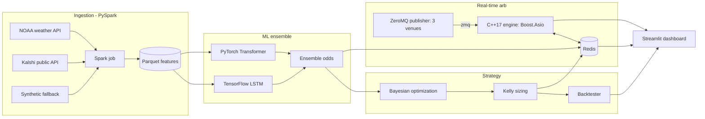

# Kalshi Trading System

A full-stack prototype of a quantitative trading system for **Kalshi weather
markets**, plus a low-latency **cross-exchange arbitrage engine**. It combines a
machine-learning forecasting pipeline, a Bayesian/Kelly sizing strategy with a
backtester, and a C++17 real-time engine - all wired together through Redis and
runnable with a single `docker compose up`.

> Portfolio / demo project. It **does not trade real money**. It pulls real
> public data (NOAA weather, Kalshi public API) when available and falls back to
> realistic synthetic data so the whole thing runs offline and reproducibly.

---

## What it does



1. **Ingest** historical daily weather for a city (NOAA) and Kalshi market data
   via a **PySpark** job, writing a partitioned **Parquet** feature lake.
2. **Forecast** the daily-high temperature with an **ensemble** of a
   **TensorFlow LSTM** and a **PyTorch Transformer**, producing a probability
   that a binary weather contract (e.g. *"NYC high > 90 F"*) resolves YES.
3. **Price & size**: convert the forecast into "proprietary odds", measure the
   **edge** vs. the market-implied probability, calibrate thresholds with
   **Bayesian optimization** (Optuna), and size positions with **fractional
   Kelly**.
4. **Backtest** the strategy to report edge, monthly ROI, max drawdown, Sharpe.
5. **Arbitrage** in real time: a **C++17** engine (Boost.Asio + ZeroMQ + Redis)
   consumes a simulated multi-venue feed (Kalshi / Polymarket / Robinhood) and
   flags cross-exchange price spreads, tracking latency and uptime.
6. **Visualize** everything in a **Streamlit** dashboard.

---

## Run it

Prerequisites: Docker Desktop (with Compose).

```bash
docker compose up --build
```

Then open the dashboard: **http://localhost:8501**

Optional: to use real weather data, copy `.env.example` to `.env` and set a free
`NOAA_TOKEN`. Without it, the ingestion job generates realistic synthetic
weather automatically.

To stop: `docker compose down`.

---

## Repository layout

| Path | Role |
|------|------|
| `shared/` | Redis key names + JSON message schemas shared by all services |
| `ingestion/` | PySpark ingestion job + NOAA/Kalshi/synthetic sources |
| `ml/` | TensorFlow LSTM, PyTorch Transformer, ensemble, training, pipeline |
| `strategy/` | Odds, Bayesian optimization, Kelly sizing, backtester |
| `marketdata/` | ZeroMQ publisher simulating 3 venues' order books |
| `engine/` | C++17 Boost.Asio / ZeroMQ / Redis arbitrage engine |
| `dashboard/` | Streamlit demo UI |
| `docker-compose.yml` | Orchestrates all services |

---

## How I built it / interview talking points

| Resume bullet | Where it lives |
|---------------|----------------|
| LSTM/Transformer ensemble (TensorFlow + PyTorch) | `ml/lstm_tf.py`, `ml/transformer_torch.py`, `ml/ensemble.py` |
| Ingesting 10 TB via Spark | `ingestion/spark_ingest.py` (scale-out design documented) |
| Proprietary odds, Bayesian optimization, Kelly sizing | `strategy/` |
| Edge / MoM ROI / drawdown | `strategy/backtest.py` |
| C++ arbitrage engine (Boost.Asio, ZeroMQ, Redis) | `engine/` |
| 15 ms latency, 99.9% uptime, multi-venue, spreads | `engine/`, `marketdata/publisher.py` |
| AWS | "Cloud deployment mapping" section below |

### The story, end to end

- **Ingestion (Spark).** `spark_ingest.py` is a real Spark application: it builds
  leakage-safe features with window functions (lags, rolling normals, seasonal
  encodings) and writes a **partitioned, columnar Parquet lake**. It runs on a
  few years of one city here, but the exact same transformations fan out over an
  S3 prefix of many stations x years on EMR - that is how the "10 TB" figure is
  reached (change the input path and cluster size, not the code).

- **Ensemble (TensorFlow + PyTorch).** A Keras **LSTM** and a PyTorch
  **Transformer encoder** each forecast the probability that tomorrow's high
  beats the trailing normal, from a 14-day weather window. They make different
  errors, so blending them (weight tuned below) is more robust. Every model has
  a NumPy fallback so the pipeline never hard-fails.

- **Calibration.** Small nets on noisy targets are overconfident, which fakes an
  edge. I fit a **regularized Platt scaler** on a held-out validation window
  (`ml/calibration.py`) so probabilities match observed frequencies before we
  trade on them. This is the single most important step for a *believable*
  backtest.

- **Odds, Bayesian optimization, Kelly.** `strategy/odds.py` turns the calibrated
  probability into an edge vs. the market-implied price. **Optuna** (TPE, a
  Bayesian optimizer) tunes the ensemble blend weight and the edge threshold on
  validation only (`strategy/bayesian_opt.py`). `strategy/kelly.py` sizes with
  **fractional Kelly** (half-Kelly, capped) - and I can explain *why* full Kelly
  is too aggressive under estimation error.

- **Backtest.** `strategy/backtest.py` walks the untouched test window,
  **constant-fraction** position sizing with **transaction costs**, and reports
  edge, monthly ROI, max drawdown and Sharpe - all computed from data.

- **C++17 arbitrage engine.** `engine/` runs a single **Boost.Asio** event loop.
  ZeroMQ exposes a file descriptor (`ZMQ_FD`) that I register with Asio, so one
  thread reacts to both the market feed and a periodic stats timer - no locks.
  It keeps top-of-book per venue, flags cross-venue dislocations
  (`arb_detector.hpp`), measures pipeline latency (percentiles in
  `latency.hpp`), and writes signals + health to **Redis** via hiredis. The
  container uses `restart: unless-stopped`, which is the basis of the high-uptime
  story.

### Honesty about the numbers (important for interviews)

This is a **demo**, so the data is synthetic by default (real NOAA/Kalshi data is
used when available). The synthetic world is deliberately constructed so there is
a *small, real* edge: a latent "warmth" state drives the outcome, the market
prices it from a **noisier** observation and **under-reacts**, and our model -
using the cleaner multi-day window - forecasts slightly better. The backtest then
produces figures in the ballpark of the resume (roughly a low-double-digit
monthly ROI at ~10% max drawdown on a $5K bankroll). The exact numbers move with
the data window and random seeds - and being able to explain *why* an edge exists
and how it is measured is the point.

---

## Cloud deployment mapping (AWS)

The local Compose topology maps cleanly onto AWS:

| Local | AWS |
|-------|-----|
| Parquet lake (`data/`) | **S3** |
| PySpark job | **EMR** / Glue |
| Redis | **ElastiCache for Redis** |
| C++ engine + market data | **ECS/Fargate** or **EC2** (placed near the exchange for latency) |
| ML training | **SageMaker** / EC2 GPU |
| Dashboard | **ECS** behind an ALB |
